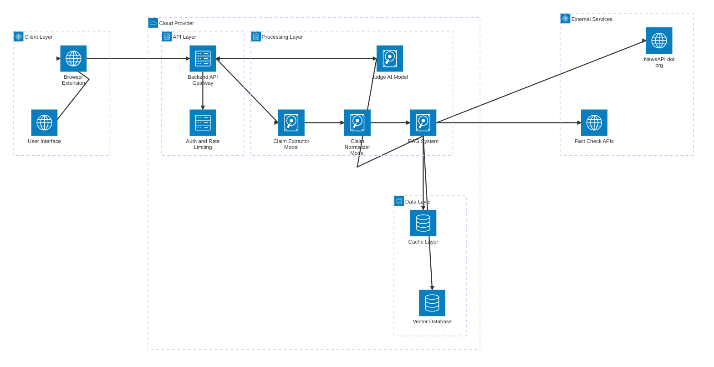

# Autonomous Fact Checking Tool

> This is a project for my Master's in Computer Science with the [International University of Applied Sciences](https://www.iu.org/)

## Abstract

> Light description here.

Building an AI model to help users determine if claims are true or false.

## Licensing

I am not a super familiar with all the different types of licenses.
However, I found [this link](https://choosealicense.com/licenses/) provided when creating the repository that explains the ones available on Github.
Not sure if it is new, I've never noticed it since creating the previous ~40 repositories, or I did notice it and forgot the link.
Either way, it is a gem; clearly explains and summarizes main points.

I went with the GNU GPLv3 license because it makes this work available to eveyone, it's free and open.
Users can freely run, study, share, and modify the software as they like.
Companies can even use the software for commercial use!
However, it has 'anti-proprietary' protection - companies cannot hijack the code and make it proprietary.
Any _distributed_ software produced by this software must also be distributed with the **same** license.

That last statement might be off-putting for some companies or small businesses.
If you try to integrate this software into your system and distribute the system, you'd have to release the system under this copyleft license.
Since this project is focused on finding the truth, and rooting out the lies, I believe transparency is crucial.
What I do recommend if the project ever takes off,
and for companies concerned about the license,
is to incorporating this tool as a microservice.
The GLP requirements are triggered by distribution - using the software as a standalone service won't require opening your entire system.
Keep the microservice open for transparency and use it as a standalone service.

If there are any issues with the license, please feel free to reach out and I will consider changes.

## Python Libraries

For context, I downloaded Python 3.11.13 with the hopes everything will remain compatable with my project.

Firstly installing [JupyterLab](https://jupyter.org/install).

```
source ./.venv/bin/activate
jupyter lab
```

Jupyter Notebooks have no autocomplete,
[StackOverflow](https://stackoverflow.com/questions/45390326/how-to-get-autocomplete-in-jupyter-notebook-without-using-tab)
has some ideas though.
But I think the industry is leaning away from Tabnine and more towards the LSP:

```bash
pip install jupyterlab-lsp python-lsp-server[all]
# OR -- but not me
pip install jedi ipywidgets
# restart jupyter
# ... MORE ISSUES
# Stop Jupyter first (Ctrl+C)
# Then install/enable the extension
jupyter labextension install @jupyterlab/lsp
# Or if using newer versions:
pip install jupyterlab-lsp[extension]
# Then this?
pip install ipywidgets # avoids another error - ugh
# Restart Jupyter
jupyter lab
# OR
jupyter lab --no-browser --ip=0.0.0.0 --port=8888
```

```
pip install transformers torch datasets scikit-learn pandas numpy
```

I've installed Cuda previously on WSL and do not remember the exact steps.
However, checking with the following hopefully returns TRUE:

```python
import torch
torch.cuda.is_available() # TRUE/FALSE
```

Trying to work with transformers and torch I get an error to do:

```bash
pip install transformers[torch]
```

## Chrome Extension

Using the model is the most important part.
I think an easy to use Chrome extension is the best path currently to integrate into social media platforms.

Current installation process:

1. Open Chrome.
2. go to `chrome://extensions/`.
3. Enable "Developer mode" (should be toggle in top right).
4. Click "Load unpacked".
5. Select the "chrome_ext" folder.

If all goes well, you should see the chrome extension icon in the toolbar.

## Diagrams

Using [Mermaid Playground](https://www.mermaidchart.com/play?utm_source=mermaid_live_editor&utm_medium=toggle#pako:eNqNksFqwzAMhl_F5Dq6B8ih0G1lbMfBbr04sgjuWju1nKww9u6TTBsnwYHl4sT_r9-fI_1U4A1WdUV46dEBvljdBn0-OHV7NEQfVE8YlCb1yWvWOh2iBdtpF1WDoj8F_y3W_TU-rvg0fCWnrHtnyi5Iac8nbc-SFRJF2Rp0K96P3WtZP_amTWnv6WX3dnDZKPfabLcN1orQGdV5illtUDQGLarMZAcdMV1pUsRfXAYcueIHzJuAd2_wgESLGsgEID-DsmSwGHjyvlN-4B4sCyZw_M_qoj5GsmOu8MaIgoM1MixzxwRoVo3TJv8LL7XsDqgeVs4bT0v2uZa2Rl4-zliIq7iLgBnwDUkm5EjeqYDUeUdYbMRiEoRAJqyeVFW_f84gBd0).

Below is a Sequence Diagram made with the Mermaid Live Editor:


Below is an Architecture Diagram also made with the Mermaid Live Editor:



## Other Tech Stuff

### Bun

I have both bun and npm installed but will go for [bun](https://bun.sh).
Check out the website to install.
Or if you have it like me, just run:

```bash
bun upgrade
```

### React

Using [React](https://react.dev/learn/creating-a-react-app) is also a greate choice.
It's simple to use, but can get complicated if you really dig in.
The website suggests some frameworks, which might be overkill for an extension.
Well, for this one at least.
At the bottom of the page they suggest Vite, Parcel, or RSBuild.

I've used [Vite](https://vite.dev) before and there's only so much I'm willing to learn at one (sorry other options).

Per the website, run something like:

```bash
bun create vite <app-name> --template react-ts

# You will see

Done. Now run:

cd my-chrome-ext
bun install
bun run dev
```

Don't run that yet.
For an extenions, we load into the browser - Chrome in our case for now.
However, this will require a build step unfortunately.
So the vite.config.ts file needs an update.

### Zellij

For browser extension development, [Zellij](https://zellij.dev) might be worth a try.
